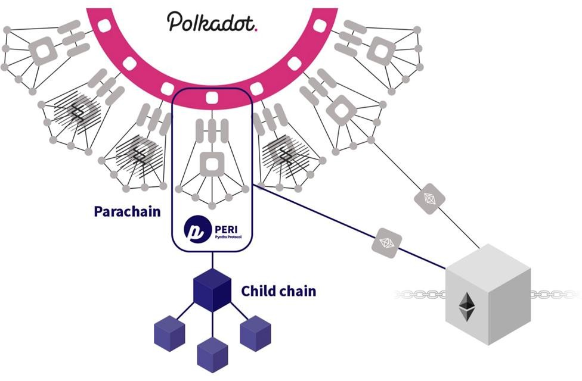

# INTRODUCTION

## What is Peri Finance ?

PERI Finance is an innovative synthetics issuance and derivatives market that utilizes blockchain technology to supercharge trades through its protocol.

PERI Finance allows accessing a wide range of both traditional financial and crypto assets in the form of leverage and non-leverage synthetic products. 

PERI Finance is a decentralized cross-chain synthetic issuance and derivative exchange protocol that provides unlimited liquidity on Polkadot network. It gives an opportunity to access a wide range of both traditional financial and crypto assets in the forms of leveraged and none-leveraged synthetic products. We empower you with lower GAS fee, speedy transaction, and ample security from front-running or flash loan. 

