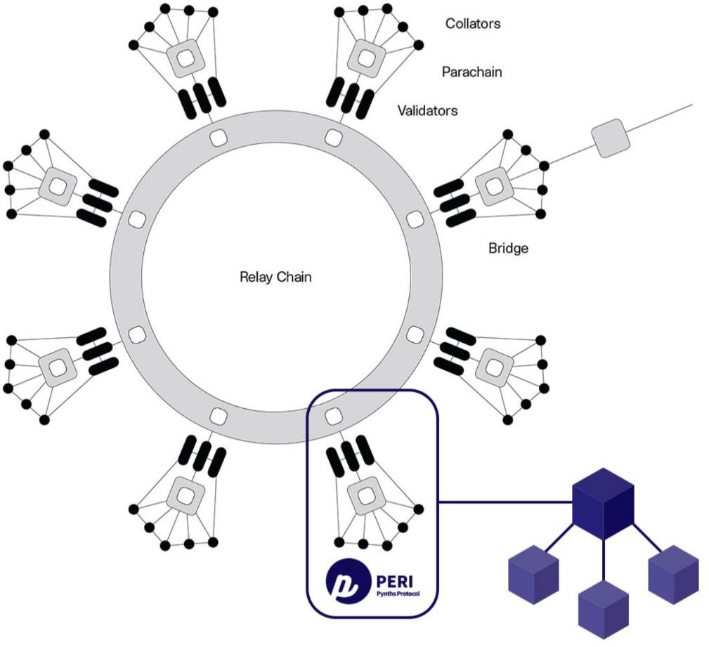
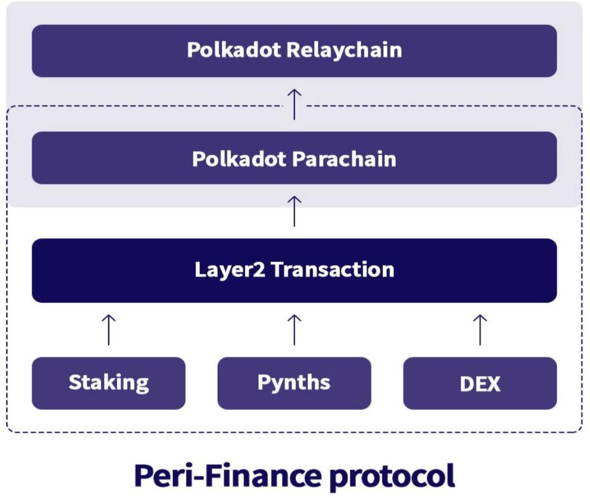
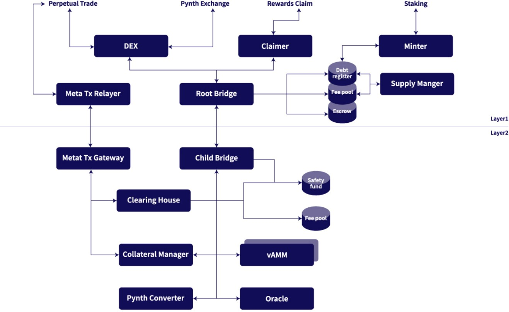
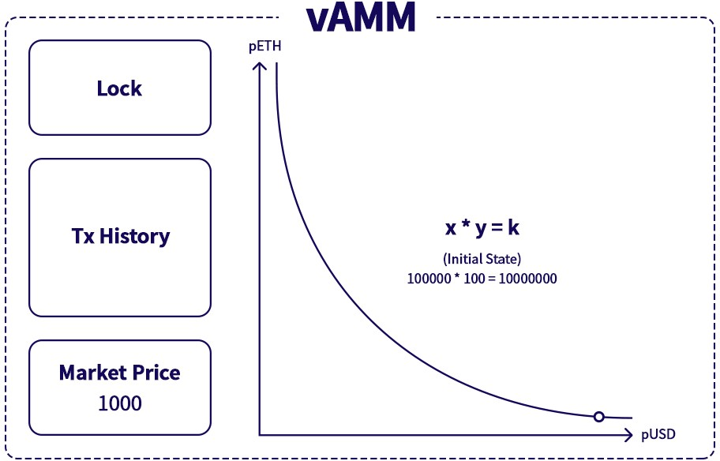
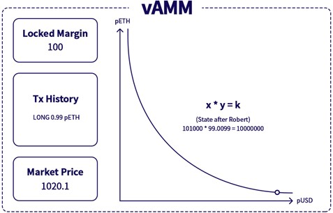
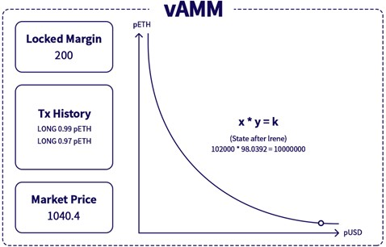
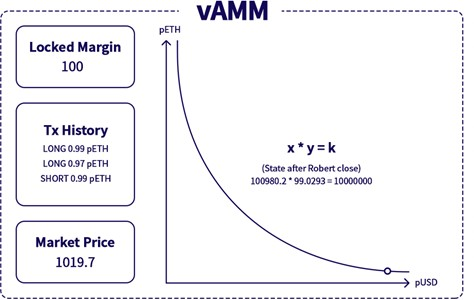
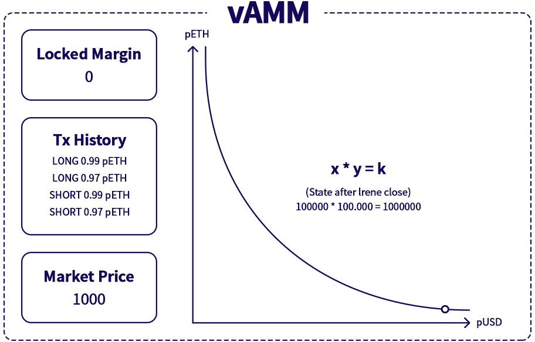

# ENGLISH

**PERI FINANCE**

**PERI WHITE PAPER Ver. 0.8**

## Abstract

PERI Finance is a decentralized cross-chain synthetic issuance and derivative exchange protocol that provides unlimited liquidity on Polkadot network. With PERI finance, anyone can access traditional financial products and crypto assets without hustles and bustles. Additionally, PERI Finance provides solutions to current issues suffering Defi-projects on Ethereum including absurdly high GAS fee, slow transaction speed and the possibility of various attacks such as front running and flash loan by harnessing Layer2 with OVM\(Optimistic Virtual Machine\).

On PERI Finance, anyone can enjoy the opportunity to accessing a wide range of traditional financial and crypto assets in the forms of both unleveraged and leveraged synthetic products by removing difficult procedures and inconvenient processes which are obligatory for anyone to be exposed to the investment assets in the traditional financial market. By simply staking PERI and minting pUSD, users can convert one asset to another or open long or short positions of leveraged contracts underlying various assets without any restriction. Pynth, stands for Peri Synthetic asset, is a synthetic asset which price follows to the price of the underlying asset. Pynths currently provided by PERI Exchange are Forex, Crypto Currency and Commodity.

PERI exchange has no need of liquidity provider. For the transaction of converting Pynths, the counterparty is the debt pool collateralized by PERI and USDC staked by the holders, so the liquidity available in the pool is infinite and no slippage exists. As for leveraged Pynths, perpetual contracts trading, virtual AMM backed by the staked PERI is the mechanism to provide the liquidity. Thanks to vAMM's unique property, there is no liquidity provider involved in the trading so the stakers have no risk to lose their PERI nor USDC.

The stakers are incentivized by 3 types of rewords. 1. the trading fees taken and pooled whenever Pynths are exchanged or leveraged Pynths contracts are traded on PERI Exchange. 2. PERI inflation rewards designed to pay for staking PERI and USDC. 3. the profits share generated by PERI assets. They will be distributed to the Stakers based on the contribution to the network. PERI Asset is an A.I Arbitrage Trading system operated by fund raised by PERI sales. It creates profits by finding risk-free arbitrage in the traditional market finance market and the crypto market.

Peri White Paper 5

**PERI, Liquidity Pool and Pynths**

**02**

### Staking and Pynths

#### Staking and Reward

PERI is a utility token used to create a liquidity pool in the process of staking, generating the basic Pynth, pUSD. It is also a tool to be used for voting within PERI DAO, which will play a pivotal role in the development of PERI Finance. PERI holders will receive three different rewards by staking PERI or USDC and minting Pynths. The ratio of PERI to USDC will be 8:2, which can be changed by PERI DAO later.

The first reward comes from PERI inflationary supply policy. Initial supply of PERI will be 11,000,000 and 9,000,000 more will be issued for 40 months as compensation for staking with weekly interval, resulting in a total of 20,000,000 in circulation. 52 weeks after staking rewards start, inflation amount decreases weekly by 1.25%. After 40 months, the annual inflation rate will be fixed at 5%. 80% of the inflation reward will go to users who staked PERI and the rest to users staking USDC, which can be changed by PERIDAO later.

The second reward is the distribution of PERI Assets' revenue. The managed funds come from 50% of the fund raised by PERI token sales, so the holders can be rewarded additional profits only by staking PERI. The profit only goes in proportion to those who maintain C-Ratio above 400% during rewards claiming period with PERI \(50%\) and BTC/ETH \(50%\).

Finally, the distribution of commissions incurred in Pynths transactions and leveraged Pynths contract trading. By staking PERI and USDC, users can mint pUSD . Users can exchange it for the other Pynth such as pBTC or lock some amount of pUSD for opening leveraged Pynth position like pBTC, pUSD, the system will take approximately 0.3% of the fee and transfer it to the fee pool which is to be distributed proportionately to the entitled PERI stakers. The fee rate of exchanging Pynths can vary depending on the assets.

#### Collateral Ratio and Mint Pynths

The collateral ratio \(C-Ratio\) will be set to an optimal ratio of 400%. The reason why C-Ratio is lower than other competing projects is that the risk of Pynths' position in the protocol is hedged with traditional financial market products, reducing the risk, liquidating collateral at 150%, and reserving loss insurance funds to the platform. With all those risk management components it is possible to

add more stability to the platform, which give users the opportunity to be exposed to more assets. As PERI's price moves, this collateral ratio \(C-Ratio\) also fluctuates. When the price of PERI rises, the increase value of the PERI can be used to generate additional pUSD, which can be exchanged to additional Pynths assets. Conversely, when it falls, some pUSD can be burned to increase the collateral ratio. Users who maintain collateral ratio above this optimal C-Ratio can claim the exchange fee reward and inflation reward according to the staking proportion.

#### Pynths

Pynth stands for PERI Synthetic Assets and is a synthetic asset of Forex, Indices, Commodities and Crypto Currency in traditional financial markets. The price moves according to the actual price of the underlying asset. You can call it Delta One derivatives, however since transactions are carried out by smart contracts within the blockchain network and all assets sits on my wallet, they are transparent, very convenient and highly reliable. Pynths products are USD, EUR, GBP for Forex, S&P 500, HANGSENG for Indices, Gold, Silver, Oil for Commodities, BTC, ETH, LTC and Inverse Crypto Currency for Crypto Currency.

#### Liquidity Pool

PERI Liquidity Pool is a pool created in the process of PERI holders staking PERI and minting Pynth called pUSD. The pool acts as a liquidity provider, which is the counterparty when trading pUSD to pBTC or pEUR, for example. Therefore, it can be said that liquidity is infinite. In other words, there is no worry about lack of liquidity or slippage existing in traditional financial markets. However, if all users only have pBTC and the BTC price rises by 50%, the total debt also increases by 50%. In this case, the collateral pool, the staking pool has the opposite position, pBTC sell \(or inverse piBTC\), so the buy/sell ratio plays an important role in the overall collateral ratio of the system. PERI Finance will increase the stability of the system by reducing the risk of various methods such as position hedge in the on/off chain for the position imbalance of the system.

## PERI Exchange

#### What can you do?

Pynths assets provide users with a way to buy or sell a variety of traditional financial assets without having an underlying asset. Users have the opportunity to easily and comfortably move their asset from one to another to make profits without going through any procedures or censorship mandatorily enforced in traditional financial systems.

PERI Exchange is a Pynths\(synthetic assets\) derivative DEX without an order book. The dApp provides both leveraged and unleveraged products. Users are able to converting one Pynth to another without worrying about how deep the liquidity nor slippage because the debt pool smart contract backed by the staked collateral plays the role of liquidity provider. Users are also able to be benefited by taking short or long positions of Pynths with 20x leverage. The Pynth prices are provided by Oracle while Pynth perpetual contract prices are determined by virtual AMM.

#### How to convert one Pynth to another

To converting Pynths, minting pUSD is the first step. By locking PERI or depositing USDC using a smart contract, you can min pUSD and create collateral pool. The smart contract limits pUSD amount to keep the collateral rate above 400%, and transfers pUSD into the user's wallet. Then user debt ratio is updated and newly updated record is written in the debt book. You can also use minted pUSD to exchange for other assets of your choice. For example, when you exchange pUSD to pBTC, the system burns pUSD and generates pBTC for the value excluding the 0.3% fee and puts it in the user's wallet. Any counterparty, order book or order matching system are not required and transactions are made by infinite liquidity, and system total debt is also unchanged.

#### How to make Profit by exchanging Pynths

When the value of your Pynths increases, you can exchange them for pUSD at any time to unlock the staked PERI or USDC as collateral. In this case, the following cases may occur.

* When PERI's price rises, the collateral ratio also rises, in which you can generate additional pUSD up to the optimal C-ratio\(400%\). So you can get additional Pynths.
* When PERI's price falls, the collateral ratio also falls, in which pUSD must be burned up to the optimal C-ratio. Otherwise, you will not be able to claim any rewards.
* When unlocked PERI staking rewords comes in, you can transfer the amount to other crypto exchange to sell it or you can mint pUSD to exchange to Pynths,.
* When pUSD is still remained even if unlocked all staked PERI buing enough Pusd, you can exchange the profitable pUSD to ETH or PERI using LP pools such as Uniswap.

#### What is perpetual contract?

Perpetual contracts are one of the most popular derivative products in cryptocurrency space ever since pioneered by bitMex. Perpetual contracts allow traders to speculate on the future price of a given asset by buying \(going long\) or selling \(going short\) perpetual futures contracts. Unlike typical futures, perpetual contracts do not expire and remain effective until the trader closes their position. The price of perpetual contracts will often diverge from the price of underlying assets. These deviations signal sentiment on the exchange - if a majority of traders expect the underlying asset to increase in value over time, the price of the perpetual contract will likely exceed the spot price. Likewise, if most traders expect the price to fall, the price of the perpetual will be below the spot price.

There are two mechanisms that moderate this process, and function to keep the perpetual contract

price close to the spot price.

The first is funding payment. Traders with opposite open positions will pay each other a funding payment on hourly basis, depending on market conditions. If the contract price is above the underlying asset price, longs will pay shorts. If the contract price is below the underlying Pynth price, shorts will pay longs. The size of the funding payment is determined by the difference between the contract price and the underlying Pynth price, as well as the trader’s position size.

The second is arbitrage. Arbitrageurs are able to make profit when the contract price diverges significantly from the underlying Pynth price. If they hold a Pynth, they can take the opposite side position and earn funding payments.

#### What is virtual AMM?

PERI Exchange will use virtual AMM model similar to Perpetual Protocol’s for perpetual contract. In

position of Pynth perpetual contract. The formula of the vAMM is the same x\*y=k as Uniswap’s. The vAMM calculates the entry or exit price in the same way prices are calculated on Uniswap whenever a trade is done,

Thanks to the model, Pynth perpetual contract exchange has key features as below:

* No need for liquidity or liquidity providers.
* There is no order book.
* The price only moves when positions are opened or closed.

#### What's the underlying assets

Currently, PERI Exchange supports four asset classes, including Forex, Commodities, Indices and Crypto Currency. As Forex, pUSD, pEUR, rGBP, rAUD, rCAD, etc. are supported. For Commodities, Gold and Silver are supported per ounce and Oil is supported per barrel.

In addition, Cryptocurrency supports products such as pBTC and pETH, and inverse products such as piBTC and piETH.

#### Rewards

In order to create more stable PERI ecosystem by encouraging trading in PERI Exchange, it is designed to incentivize the stakers by rewarding 50% of the revenue distribution generated from PERI assets on pro-rata basis and the rest 50% is to reward to the stakers who participate in trading based on their contribution to total trading volume. The payment will be executed in PERI 50%, BTC or ETH 50%. This is to reward more exchange fees to holders who participated in staking through increasing Pynths trading volume. In addition, the stability of the system is improved by allowing only stakers who keep the collateral ratio above the optimum ratio \(400%\) to claim the exchange fees.

## PERI Asset

#### Why managing asset?

Exchange Fee reward and inflation reward can be enough to motivate the users. However, PERI Finance has reinforced the purpose of using the system to users by distributing the profit generated by the trading system verified by the integrated arbitrage of the traditional financial market and the crypto market for many years. PERI, BTC, and ETH will be used for the reward payment. It is designed to reward the stakers steadily without using additional assets, and with some of the revenue, PERIs will be bought back from other exchanges to help PERI's price go up and some of them are to be paid as the reward and the rest to be burnt.

#### Where is the money from?

The funds used for PERI Assets are funds raised by PERI sales, which are supposed to be sold for 20 months.

#### Distribution Rule

50% of the profit distribution of PERI Assets will incentivize stakers to maintain the collateral ratio above 400% on pro-rata basis of staking, and the remaining 50% will be distributed to participants on trading according to the ratio of the trading volume.

PERI White Paper 14

## PERI DAO

PERI tokens are also used for governance. We have created a PIP \(PERI Improvement Proposals\) system to collect community opinions, so that anyone can submit a PIP using 1PERI, and when adopted, the number of PERIs used for voting will be reflected in the system. The PERI used at this time will be returned.

## System Architecture

#### Issues on Existing Defi projects

Currently, the majority of the activities in DeFi are found in one main chain, Ethereum, which have created significant issues since the Ethereum cannot handle the multitude of transactions that are executed by these DeFi applications. The Ethereum network has often been congested and gas fees have skyrocketed as a result of the explosive growth of these DeFi applications. Furthermore, with the possibility of flash loans, more and more attacks like front-running are being conducted on vulnerable contracts.

#### OVM & Layer2 solution on Polkadot

In order to effectively solve issues of existing DeFis on Ethereum such as too-much-to-trade GAS fee and front-running, Peri finance is applying Layer2 solution with OVM\(Optimistic Virtual Machine\) on Polkadot by harnessing WASM and Substrate. By leveraging Optimistic Rollups on Relaychain and Polkadot’s nature, it is possible to provide the Pynths issuance and exchange platform that supports enhanced scalability and Interoperability. Bringing most of the work to Layer2 with OVM reduces the cost and time of transactions significantly. Furthermore, Polkado will enable value transfers across variety of different blockchain networks when the ecosystem matures. Eventually, the platform is going to be more robust, stakers protected far better.

#### Building Debt Pool

To create a debt pool, users must stake PERI. The user locks up PERI and creates pUSD, which is the default Pynths, using a smart contract. The smart contract help users generates pUSD as much as the amount limited by the optimal collateral rate, and after the system records the debt, the smart contract creates pUSD and transfer it to the user's wallet. The debt generated in this way is divided by the total amount of debt increased by the activity to determine the debt deposit ratio.

These debt deposit ratios are recorded in the system and used for distribution of fees. The debt pool thus created is used as the counterparty to the transaction.

#### Paying Debt

In order to pay off the debt, the required amount of pUSD must be burned. When the burning starts, the system calculates the amount of debt, updates the total issuance of pUSD by the amount of pUSD burned, and unlocks the corresponding amount of PERI. PERI unlocked can be transferred at any time. If pUSD is insufficient and the debt remains, you can unlock all PERIs by paying off the debt with pUSD purchased through other ways. If no action is taken, PERI may remain unlocked. On the contrary, if pUSD remains after the debt is paid off, it is possible to purchase additional PERI or

exchange it for ETH using other exchanges such as Uniswap. To this end, we will increase devices that compensate users who provide liquidity as a maker to Uniswap and Curve.

#### Converting Pynths

Let’s take converting pUSD to Peth as an example. First, pUSD is burned to update the user's wallet and total number of pUSD. The system determines the volume of exchanged Pynths using the exchange rate provided by Oracle, sends the 0.3% pUSD fee to the fee pool, and issues pETH for the remaining pUSD. Update user wallet and total pETH issuance. No counterparty is required, and one of the two Pynths of the same value is burned and the other is created so that it does not affect the debt pool.

#### Trading Perpetual Contracts

The perpetual contract is traded by collateralizing pUSD. Users can initiate trading Pynth perpetual contract with pUSD by selecting leverage and amount of pUSD as the margin. Here is how the trading goes.

* * Robert specifies 1000 pUSD as the collateral and execute 100 pUSD as the margin to open a 10x leveraged long position.
  * The smart contract locks the collateralized amount of pUSD and updates the asset price in the vAMM according to the margin amount, position direction \(long or short\), and the

amount of leverage.

* * Assume we have 100 pETH/pUSD and 100,000 pUSD in our vAMM as its initial state.

The amount of pUSD in our vAMMs will become 101,000, the amount of pETH/pUSD will become 99.009901 \(100 \* 100,000 / 101,000\), which is calculated by the constant-product curve, and the position Robert opens is 0.990099 pETH\(100 - 99.009901\).

* * Now, Irene also uses 100 pUSD to open a long position with 10x leverage. Her position size will be 0.970685 pETH \(99.009901-98.039216\) as calculated by the vAMM.
  * After Irene’s action, Robet closes his position and realizes a profit of 19.80 pUSD \(102,000

- 98.039216 \* 102,000 / \(98.039216 + 0.990099\) - 1,000\), which is calculated by vAMM with decreasing pUSD amount and pETH/pUSD. The smart contract sends 19.80 pUSD to Robert’s wallet.

* * Consecutively, Irene closes her position too. She lost -19.80 pUSD \(100,980.2 - 99.0293147 \* 100,980.2 / \(99.0293147 + 0.970685\) - 1000\) after closing her position. The smart contract transfers 19.80 pUSD from locked amount of pUSD as the collateral in Irene’s wallet to the vault.

#### Leverage on perpetual contract

PERI Exchange let traders to use leverage up to 20x. Traders need to lock more amount that the intended margin used for opening short or long position as the collateral. If a trader wishes to open more position than 20x of margin, he needs to lock more amount of pUSD back the opened position. However, it still is as same as using max 20x leverage since the collateral is used for backing up the position. Opening positions with max 20x position means your margin ratio reaches 5%, which is close to liquidation and high risk of losing the collateral.

#### Periodic Funding Payment

Periodic funding payments is the most common mechanism to do perpetual swaps. PERI Exchange follows FTX's method to calculate the funding payments, which is done according to the formula below:

FundingPayment = PositionSize \* \(\(TWAP\_Perpetual - TWAP\_Pynth\) / 24\)

#### Fees

Approximately 0.3% of the value is deducted from all Pynths exchanges and 0.03% of notional amount is charged for Pynth perpetuals. The fees are going to be sent to the fee pool. This is distributed according to each staking ratio by requesting exchange fee to users with a C-ratio of 400% or higher. The fee reward will be available for claiming in pUSD every Saturday at 24:00 UTC.

#### The oracle

The value of all synthetic assets in PERI Exchange will use Oracle, which receives and processes quotes from well-trusted institutions in the current traditional financial market, and then uses various Oracle partners such as Chainlink. This will also be decided through PERI.DAO

#### Liquidation

For the soundness and stability of the system, it is indispensable to apply automatic liquidation. The liquidation will immediately liquidate the Pynths held by the user if the collateral rate touches 150%.

When Pynths are liquidated, they are converted to pUSD. In order to exit and unlock all PERI, the user need burn the same amount of pUSD as your debt. If you don’t have enough amount of pUSD, you neeed to buy pUSD with ETH or USDC in or outside the platform.

In terms of perpetual contract, liquidation occurs when your position margin ratio falls to 4% or below. This can be changed by PERI.DAO. The margin ratio is calculated as below

Margin ratio = \(Collateral + PnL\) / used notional margin \* 100

With the example case above, Irene’s margin ratio at the time of Robert’s closing his position is

98.02% = \(1,000 + \(-19.80\)\) / \(100\*10\) \* 100

The liquidation executed by Liquidator, which is a bot. When liquidated, Liquidator earns 1.5% of the notional amount from remaining margin while the rest of no will be go to the protocol’s loss provision fund.

## Roadmap

#### Risk and solution

The high collateral rate is an issue that the project keeps trying to address. To make staking even more attractive, we need to come up with a mechanism where it can go down to 100% or less. PERI Finance believes that the risk arising from the mismatch of the position of synthetic assets can be solved by implementing liquidation of Pynths, loss insurance funds, and hedging in the on/off-chain market. Risk can never be avoided. There are simply mechanisms to reduce risk. Therefore, in the future, we will find a better way through cooperation with traditional financial market partners, Crypto CEX and competitive DEX and Defi projects, and find a solution through PERI.DAO.

#### Development Road Map

Q1 2021 Launched on Ethereum Mainnet. 

Q2 2021 Launched staking on Parachain

Q3 2021 Launch Pynths DEX contract

Q4 2021 Launch Pynths Perpetual contract

Technically, Peri platform is going to be deployed on Ethereum first. After the transition period, Peri will be on Polkadot in Q2 2021, After successfully apply Peri to Parachain on Polkadot, the team will add Perpetual contract to the exchange. The team will keep constantly and closely eyes on scaling solution on Ethereum such as ZK-Rollups as well as Parachains with WSAM and EVM on Polkadot so that we can apply the solutions to the platform as soon as ZKR supports smart contract well enough or any technology that works better on Polkadot. In order to make better platform and serve well to need of defi, the team is working closely with Polkadot and parachain projects.

#### Perpetual contract

Peri finance is building Pynths perpetual contract on the base of virtual AMM. The platform is going to provide almost all Pynths vs pUSD pairs and 20x leverage for Perpetual contract. Having both unleveraged Pynth and the max 20x leveraged swap contract benefits the stakers more by the fair amount of trade fees rewords because more intrigued arbitrageurs find more opportunities and trade more on PERI Exchange. In addition, everyone connected to Polkadot can be benefited by the platform since the platform will be on a Parachain,.

#### Asset Management

Currently, we are managing assets through a trading system using a trading algorithm through the Arbitrage of Fiat Forex and Crypto Currency market. For more stable profits, we will develop M.L. \(Machine Learning\) to increase profits through market forecasting and capture arbitrage opportunities for various products into a system that utilizes more diverse big data to achieve a more stable and high profit distribution.

#### PERIDAO

PERI Finance will continue to listen to community decisions on important matters for platform design and operation through PERIDAO

First of all, whoever PIP is to be submitted and the elected PIP will be decided by voting. PERI token will be used for PIP submission, and PERI token will be used for voting.

### Conclusion

It is not easy for anyone to take risks and make profits by exposing themselves to various products. However, PERI Finance wants to make investments less costly, more transparent and easier for users by creating the most accessible decentralized synthetic derivative trading platform. Therefore, on the big proposition of decentralization of finance, the team will do our best to provide users with the best ways to multiplying their asset and to build the protocol always better for users. Our clients' asset growth comes first!

