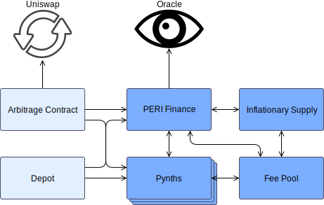

# DESIGN AND ARCHITECTURE

## Overview

The Peri Finance system is encapsulated of a number of core contract complexes, and several auxiliary contracts that enhance token liquidity and  overall system functionality. These on-chain component and how they communicate is reflected in the following high-level diagram.

The oracle, PeriFinance , pynths, inflationary supply, and fee pool elements encapsulated core functionality of Peri Finance system. Supporting Component like arbitrage and depot contracts ensure economic health of the system and does not change the fundamental behavior of system tokens.

They make sure that PERI and pynths flow freely through markets like Uniswap, improving liquidity and encouraging prices to be close to their theoretically correct values.

Each of the elements in this graph may be a complex composed of several contracts, as described below. Some relatively unimportant links have been omitted, but more detailed descriptions are available at the documentation pages for each specific contract.

## Core Components

### PeriFinance

*  PERI token Implementation.
* Tracking Operational pynths.
* Issues and burns pynths.
* Exchanges between pynth flavours.
* Mints the inflationary supply.
* Maintains the system debt ledger.

Peri Finance smart contract communicates with pynths smart contract to manage their supply, and also the fee pool to remit fees when there is exchanges occur in pynths. 

In order to properly convert between pynths, and to understand value of debt induced by minting tokens, the Peri Finance contract retrieves current token prices from the oracle.  when expanding the supply of PERI, and to distribute the new tokens appropriately this contract  communicates with the inflationary supply complex to mint the correct quantity.

Along with the debt ledger, which is a time series history of the overall value of the PeriFinance  ecosystem, issuance data for the current fee period is updated whenever pynths are issued or burnt. This is also responsible for pushing historical issuance information to the fee pool, so that as fee periods roll over, a record of what portion of the total system debt is owned by different issuers is known when computing their fee entitlements.

**Constituent Contracts**

| Contract | Description |
| :--- | :--- |
| `PeriFinance` | The main token contract. |
| `PeriFinanceState` | An auxiliary state contract which tracks current issuer data and the debt ledger. |
| `Issuer` | An auxiliary helper contract that performs the issuing and burning functionality. |
| `Exchanger` | An auxiliary helper contract that performs the exchange and settle functionality. |

#### Pynth 

* Implements all pynth tokens.

No of instances of the Pynth token contract are deployed, one for each flavour of pynth. pynths are largely interchangeable, being differentiate only by their names and prices because they run the same logic,

Pynths implement their own issuance and burning logic, but only the PeriFinance and fee pool contracts may invoke them. The PeriFinance contract uses these functions for issuance and burning by stakers, while the fee pool uses them to burn fees at the fee address and issue them to the claimers address.

**Constituent Contracts**

| Contract | Description |
| :--- | :--- |
| `Pynth` | The base ERC20 token contract comprising most of the behaviour of all pynths. Each pynth has an associated proxy and token state contract. |

#### Fee Pool 

* Computes fee entitlements based on the current exchange fee rate 
* Tracking the fees and rewards to be distributed in each one.
* Allows anyone to roll over to the next fee period once the current one has closed.
* Directs the RewardEscrow to escrow inflationary PERI rewards for eligible issuers.
* Stores and manages the details of the last several mint/burn events for each account, in order to compute the quantity of fees and rewards they are owed for the past several fee periods. 
* Allows issuers to claim any fees and rewards owed to them.

The fee pool mostly interacts with other system components through PeriFinance only. Whenever fees are collected, PeriFinance contract informs to the fee pool, it is allowed to append historic issuance records to its own account issuance ledger. 

For example, Fee Pool interacts with the oracle through the PeriFinance contract, in order to issue fees and rewards. It also retrieves other data from there, like debt ledger information, issuance and collateralization ratios, and the addresses of pynth contracts.

Fee pool is responsible for computing the quantity of inflationary rewards that issuers are entitled to, it also communicates with the inflationary supply complex. 

The RewardsDistribution contract set the level of inflationary rewards to be distributed through the fee pool, which then disburses them by adding new vesting schedule entries in the RewardEscrow contract.

**Constituent Contracts**

| Contract | Description |
| :--- | :--- |
| `FeePool` | The main contract responsible for computing and storing the level of fees and rewards issuers are entitled to. |
| `FeePoolState` | Stores a limited history of issuance data per user. |
| `FeePoolEternalStorage` | Stores fee withdrawal times for each address. |
| `DelegateApprovals` | Allows addresses to delegate to others the right to claim fees on their behalf. |

#### Inflationary Supply 

* Defines the schedule according to which PERI tokens are generated from the inflationary supply.
* Tracks for each year how many inflationary tokens have been minted so far, and how many remain.
* Distributes inflationary rewards to different recipients in the proportions specified by the Peri finance protocol; i.e. for staking versus providing Uniswap liquidity.
* Holds the minted inflationary rewards in escrow for a year after they are claimed. 
* Holds and distributes the escrowed tokens from the original token sale.

The inflationary supply complex control the flow of new PERI tokens being injected into the market. It communicates with the `PeriFinance` contract. 

The actual fraction of the weekly PERI rewards that a particular account is entitled to claim is computed by the fee pool, which is able to direct the `RewardEscrow` and `RewardsDistribution` contracts as to how they should distribute the new tokens.

**Constituent Contracts**

| Contract | Description |
| :--- | :--- |
| `SupplySchedule` | Determines the rate that inflationary PERI tokens are released. |
| `RewardEscrow` | Receives inflationary PERI rewards to be distributed after a year escrow. |
| `RewardsDistribution` | Apportions designated quantities of inflationary rewards to the `RewardEscrow` contract. |
| `PeriFinanceEscrow` | Holds the escrowed balances of PERI from the original token sale. |
| `EscrowChecker` | Augments the `PeriFinanceEscrow` contract with a function for dApps to conveniently query it. |

#### Oracle 

* Updates, stores, and distributes up-to-date token prices .
* Provides functionality to perform exchange rate conversions between pynth flavours.

The on-chain explanation of the oracle is the `ExchangeRates` contract, whose stored prices it frequently updates. The primary user of these prices is the `PeriFinance` contract, which needs them to calculate debt allocations when issuing and burning synths, and to determine the correct quantity of pynths when performing an exchange of one flavour for another.

It is also used by some other contracts, such as the `Depot` and `PurgeablePynth` contracts.

**Constituent Contracts**

| Contract | Description |
| :--- | :--- |
| Oracle | The oracle is responsible for collecting and updating all token prices known to the PeriFinance system. Although it is not a contract, it controls a known Ethereum address from which price updates are sent to the `ExchangeRates` contract. |
| `ExchangeRates` | The PeriFinance exchange rates contract which receives token prices from the oracle, and supplies them to all contracts that need it. |

### Token Circulation 

#### Depot 

The `Depot` is a vendor contract that allows users to exchange their ETH for pUSD or PERI, or their pUSD for PERI. It also allows users to deposit Pynths to be sold in exchange for ETH.

The depot has its own dedicated oracle, and all exchanges are performed at the current market prices, assuming pUSD is priced at one dollar.

### Infrastructure 

### AddressResolver

* Tracks the latest instances of all contracts required in the PeriFinance system, allowing them to be queried by a `bytes32` name

Each contract which inherits \(or mixes in when considering multiple inheritance\) [`MixinResolver`](https://docs.synthetix.io/contracts/source/contracts/MixinResolver/) will have access to the `AddressResolver` contract, and can lookup at transaction time where it's sibling contracts are located.

### Proxy

* Provides static addresses for contracts where the underlying logic can be upgraded.
* Provides the interface that allows contracts to operate beneath a proxy.

Each contract which uses a proxy must inherit from `Proxyable`. Function calls are forwarded from the proxy to the proxyable base, while return data and event information travels the other way. Ultimately most contracts should communicate with one another by proxy

The `PeriFinance`, `FeePool`, and all `Synth` contracts exist behind their own individual proxies.

**Contracts**

| Contract | Description |
| :--- | :--- |
| `Proxy` | The PeriFinance proxy contract. |
| `ProxyERC20` | A proxy contract which explicitly supports the ERC20 interface. |
| `Proxyable` | An abstract base contract designed to work with the PeriFinance proxy. |

### Utilities

These contracts mostly are not deployed on their own, but provide functionality inherited by other contracts already listed.

**Contracts**

| Contract | Description |
| :--- | :--- |
| `EternalStorage` | A persistent/unstructured smart contract storage pattern. |
| `ExternStateToken` | A partial ERC20 token contact with an external state, which all tokens in PeriFinance are built upon. |
| `LimitedSetup` | A contract which can disable functions a set time after deployment. |
| `MixinResolver` | A mixin to give the inheritor access the `AddressResolver` instance. |
| `Owned` | A contract with a distinct owner who can have special privileges. |
| `Pausable` | A contract whose operations can be paused by its owner. |
| `SafeDecimalMath` | A library for performing fixed point arithmetic at two different precision levels. |
| `SelfDestructible` | A contract that can be self destructed by its owner after a delay. |
| `State` | An external state contract which can restrict its fields to be modifiable only by a particular contract address. |
| `TokenState` | A state contract to be used with `ExternStateToken` to store balances. |

