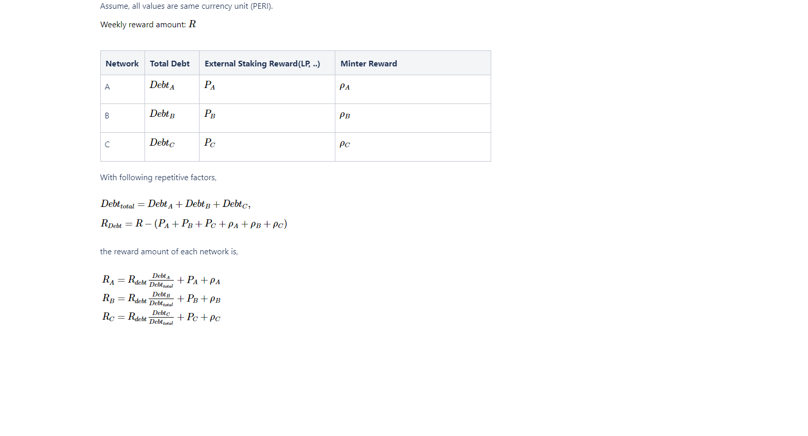

# PROTOCOL CORE EQUATIONS

Peri Finance Protocol using below equations to handle staking and subject to change 

* Staked Amount \(User\)
* C-Ratio
* Peri locked amount
* Available External token stake Amount
* Staked Escrow Balance
* APR
  * APR by user
* Reward Distribution
* Fit to claimable
* LP Price
* Staking Reward\(LP\) reward calculation algorithm

## Staked Amount

## Available External Token Stake Amount

## Staked Escrow Balance 

If \( `transferable PERI` &gt; 0 \)

`Staked Escrow PERI` = `PERI Locked Amount` - `PERI Balance`

If \( `transferable PERI` = 0\)

`Staked Escrow PERI` = 0

at, `PERI Locked Amount` = \(`debt / issuanceRatio`\) - `USDC Staked Amount`

## APR

## Reward Distribution 

## LP Price

## Staking Rewards\(LP\) reward calculation algorithm 

