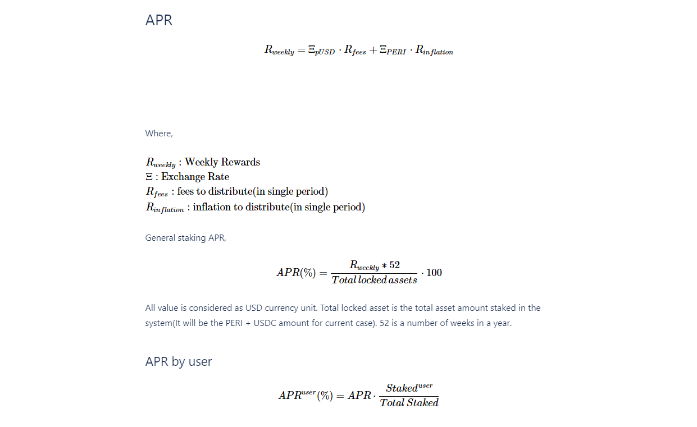

# PROTOCOL CORE EQUATIONS

Peri Finance Protocol using below equations to handle staking and subject to change&#x20;

* Staked Amount (User)
* C-Ratio
* Peri locked amount
* Available External token stake Amount
* Staked Escrow Balance
* APR
  * APR by user
* Reward Distribution
* Fit to claimable
* LP Price
* Staking Reward(LP) reward calculation algorithm

## Staked Amount

.png>)

## Available External Token Stake Amount

.png>)

## Staked Escrow Balance 

If ( `transferable PERI` > 0 )

`Staked Escrow PERI` = `PERI Locked Amount` - `PERI Balance`

If ( `transferable PERI` = 0)

`Staked Escrow PERI` = 0

at, `PERI Locked Amount` = (`debt / issuanceRatio`) - `USDC Staked Amount`

## APR

## Reward Distribution 

## LP Price

.png>)

## Staking Rewards(LP) reward calculation algorithm 

.png>)

.png>)
